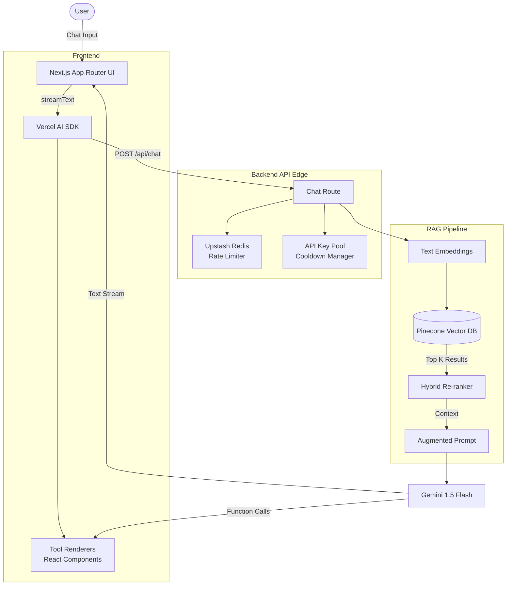

# Manav Bhullar — AI-Powered Interactive Portfolio

An interactive, AI-driven portfolio built with Next.js 15, the Vercel AI SDK, and Pinecone RAG. Instead of a standard static page, visitors can chat with an AI persona grounded in my real experience, projects, and skills.

## Why an AI Portfolio?

A static resume tells you what I did; an interactive RAG system proves I can build complex, context-aware AI applications. 

By replacing the standard portfolio grid with a conversational interface, I wanted to showcase:
- **Systems Engineering:** A full Retrieval-Augmented Generation (RAG) pipeline running on the edge.
- **Agentic Workflows:** Dynamic tool-calling that maps LLM decisions directly into rich React UI components.
- **Production Readiness:** Defensive API key rotation, robust rate limiting, semantic HTML, and accessibility features.

## 🏗️ Architecture



## ✨ Key Features

- **Hybrid Search RAG:** Combines vector similarity (Pinecone) with exact-keyword matching for highly accurate context retrieval.
- **Conversational Query Rewriting:** Reformulates follow-up questions to maintain strong search relevance across multi-turn chats.
- **Dynamic UI Generation:** The AI executes function calls (`getProjects`, `analyzeJobFit`) that render interactive, responsive React components inline.
- **Edge-Optimized:** Runs on the Next.js Edge Runtime, fetching from Pinecone natively via `fetch` to bypass SDK limitations.
- **Defensive API Management:** Pools multiple API keys, actively monitors for 429 Rate Limits, and automatically routes traffic away from exhausted keys.
- **Job Fit Analyzer:** Recruiters can paste a job description, and the AI will evaluate my real background against it, identifying matches and honest gaps.

## 🛠️ Tech Stack

- **Framework:** Next.js 15 (App Router, Edge Runtime)
- **AI / LLM:** Vercel AI SDK, Google Gemini 1.5 Flash
- **Vector DB:** Pinecone
- **Caching & Rate Limiting:** Upstash Redis
- **Styling:** Tailwind CSS v4, Framer Motion, Radix UI Primitives
- **Analytics:** PostHog

## 🚀 Local Setup

1. **Clone the repository:**
   ```bash
   git clone https://github.com/manav-bhullar/portfolio.git
   cd portfolio/Portfolio-main
   ```

2. **Install dependencies:**
   ```bash
   npm install
   ```

3. **Set up environment variables:**
   Create a `.env.local` file based on the required services:
   ```env
   # Pinecone for Vector DB
   PINECONE_API_KEY=your_pinecone_key
   PINECONE_INDEX=portfolio-rag

   # Gemini for LLM
   GEMINI_API_KEY_1=your_gemini_key

   # Upstash for Rate Limiting & Share links
   UPSTASH_REDIS_REST_URL=your_upstash_url
   UPSTASH_REDIS_REST_TOKEN=your_upstash_token
   
   # Resend for Lead Capture
   RESEND_API_KEY=your_resend_key
   CONTACT_EMAIL=your_email@example.com
   ```

4. **Run the ingestion script (Populates Vector DB):**
   ```bash
   npm run build # The ingestion script runs automatically on build
   # Or run manually:
   npx tsx scripts/ingest.ts
   ```

5. **Start the development server:**
   ```bash
   npm run dev
   ```

6. **Open [http://localhost:3000](http://localhost:3000)** to view it in the browser.
